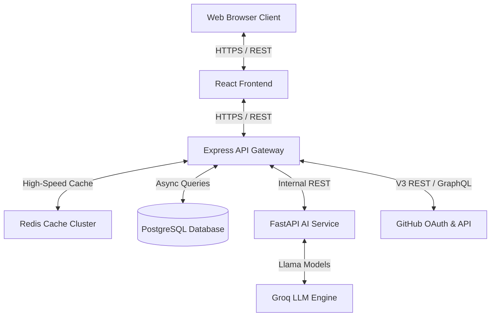

# System Architecture

DevPulse is built on a high-performance, decoupled three-tier architecture designed for massive data structures, speed, and clean separation of concerns.

---

## 1. System Topology

---

## 2. Component Directory

### Frontend (React + Vite + HSL Styling)

- **Role**: Provides the glassmorphic, responsive user interface.
- **Tech Stack**: React 18, Vite, Recharts, Custom HSL Color Palette.
- **Key Modules**:
  - `DashboardContext`: Centralized state tracker managing active repository details, simulation logs, and chat histories.

### Backend (Express.js Orchestrator)

- **Role**: Orchestrates pipeline jobs, manages PostgreSQL storage, and coordinates secure OAuth sessions.
- **Key Modules**:
  - `postgres.js`: Handles pg connection pools and automatic migrations.
  - `scanJob.service.js`: Runs long-running security cloning and audits inside background workers.
  - `redis.service.js`: Resilience cache wrapper featuring automatic JSON serialization and graceful degradation fallbacks.

### AI Service (FastAPI Inference Service)

- **Role**: Heavy text extraction, AI scoring logic, and Groq LLM API integrations.
- **Resilience**: Features strict deterministic fallbacks to maintain scoring if Groq is overloaded or offline.

---

## 3. Storage Architecture

### PostgreSQL Layer

To support dynamic JSON structures without the rigidity of traditional columns, DevPulse uses native **JSONB** columns inside PostgreSQL:

- **`PipelineResults`**: Maps structured pipeline telemetry, steps list, and raw Trivy vulnerability outputs to a high-speed `JSONB` column, enabling rapid deep querying.
- **Indexes**: Includes B-tree indexes on critical query paths (e.g. `repository`, `commit_sha`) and GIN indexes on `vulnerabilities` to search nested arrays rapidly.

### Caching Architecture (Redis)

- **Graceful Fail-Safe**: If the Redis container goes offline, try/catch connection blocks gracefully intercept the failure, routing requests directly to the database without throwing exceptions.
- **Secure Key Partitioning**: User sessions and repositories are secure-hashed (using SHA-256) to ensure API tokens are never exposed as plain-text keys.

---

> [!IMPORTANT]
> The database migration from SQLite to PostgreSQL has been fully accomplished. Raw SQL queries must utilize standard `$1` syntax parameters to prevent SQL injection vulnerabilities. Do not use Knex or Prisma ORM to ensure a lightweight codebase.
