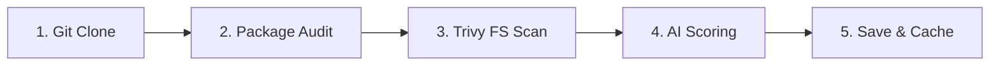

# Your First Analysis

What exactly happens when you click "Trigger Analysis" or trigger a simulated scan in DevPulse? This guide dives deep into the underlying mechanics.

---

## The 5 Stages of Ingestion

When a scan is dispatched, a background worker (`scanJob.service.js`) handles execution through five sequential stages:

1. **Git Clone / Fetch**: Clones the GitHub repository locally to a secure workspace folder.
2. **Package Dependency Audit**: Inspects `package.json`, `package-lock.json` (or pip lockfiles) for structural anomalies.
3. **Trivy File Scan**: Triggers **Trivy** in filesystem mode (`trivy fs`) to detect CVE vulnerabilities, exposed secrets, and security configuration mistakes.
4. **AI Scoring (DevPulse Score)**: Passes the health, vulnerabilities count, and commit metrics to the AI service to calculate a weighted, contextual **DevPulse Score** (0-100).
5. **Persistence**: Saves the output structured JSON results to PostgreSQL as a `JSONB` document and immediately clears any stale Redis keys to serve fresh metrics.

---

## Explaining the Metrics

Once your first analysis completes, you will see three main metric gauges:

### 1. The DevPulse Score (0-100)
- **90-100 (Green / Excellent)**: Perfectly secure, recent developer activity, clean security configurations.
- **70-80 (Yellow / Moderate)**: Minor low-severity CVEs or slightly delayed commit cycles.
- **&lt;70 (Red / Critical)**: Outdated, high-severity CVEs, or exposed API credentials/secrets.

### 2. Security Audit Breakdown
- Displays vulnerabilities classified by severity: **CRITICAL**, **HIGH**, **MEDIUM**, and **LOW**.

### 3. Pipeline Telemetry Log
- Shows the real-time build and execution logs in an interactive, terminal-like UI.

---

> [!IMPORTANT]
> A critical security gate blocks production deployment if any **CRITICAL** severity vulnerabilities are discovered during the scan! Use the [AI Copilot](file:///Users/sssa15/DevPulse/docs/user-guide/ai-copilot.md) to explain and fix them.
