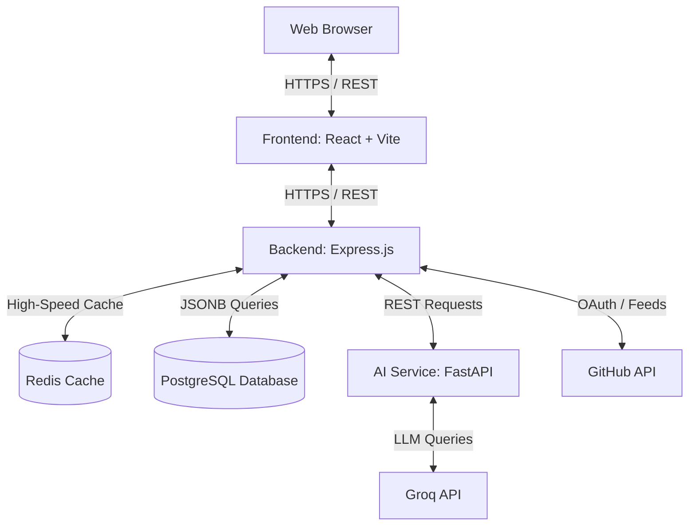

# Introduction to DevPulse

DevPulse is an all-in-one, enterprise-grade **DevSecOps Platform** powered by AI. It provides real-time quality scanning, dependency auditing, automated CI/CD simulations, and interactive AI-driven code remediation tips.

---

## Key Features

- **Automated Security Scanning**: Out-of-the-box vulnerability checks powered by container and filesystem scans (using **Trivy**).
- **Dynamic Scoring (DevPulse Score)**: Real-time intelligence scoring reflecting code compliance, open vulnerabilities, developer activity, and pipeline robustness.
- **AI Copilot Remediation**: Socratic coding assistant powered by Llama models (via **Groq**) that explains vulnerabilities and offers one-click copy-paste remediation diffs.
- **Public Report Sharing**: Generate secure, expiration-controlled sharing tokens (`dp_rpt_...`) to share static pipeline snapshots with external reviewers.
- **Enterprise Caching & Storage**: High-speed caching (using **Redis**) and persistent structured queries (using **PostgreSQL JSONB**) to ensure sub-millisecond page loads.

---

## Three-Tier Architecture

DevPulse is designed with a decoupled, high-performance architecture:

---

## Quick Navigation

- [Installation Guide](file:///Users/sssa15/DevPulse/docs/getting-started/installation.md)
- [Quick Start](file:///Users/sssa15/DevPulse/docs/getting-started/quick-start.md)
- [Local Setup](file:///Users/sssa15/DevPulse/docs/developer-guide/local-setup.md)
